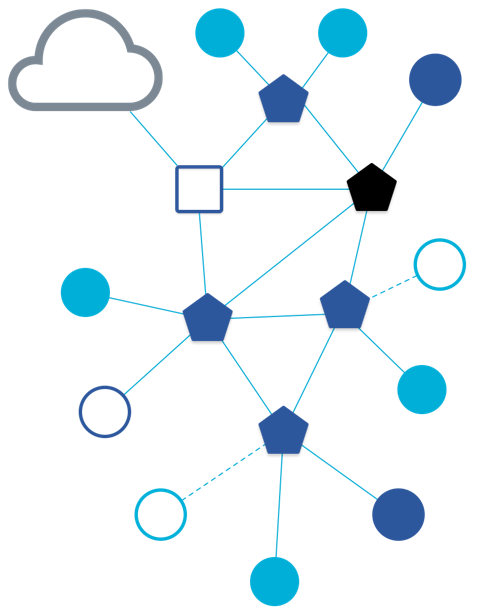

# DISPOSITIVO DI CONTROLLO REMOTO

Il controllo del cancello non dovrebbe essere mai un lavoro complicato. Sappiamo quanto possa essere frustrante dover utilizzare un'applicazione o un servizio cloud specifici, senza avere la libertà di scegliere la piattaforma o il dispositivo con cui lavorare.

Per questo abbiamo creato un dispositivo di controllo del cancello con diverse caratteristiche innovative:

- **Universale**: Compatibilità con tutti i sistemi operativi per una copertura completa e un accesso senza restrizioni.

- **Autonomo**: Il dispositivo non necessita di alcuna app o cloud per funzionare, rendendolo un sistema veramente indipendente.

- **Funzionamento offline**: La capacità di operare anche senza connessione internet garantisce una disponibilità continua.

- **Associazione immediata**: La procedura di associazione è semplice e immediata, eliminando i processi complicati o ingombranti.

- **Aggiornamenti in tempo reale**: La bi-direzionalità del dispositivo permette un controllo preciso e aggiornamenti in tempo reale.

- **Accesso remoto e temporizzato**: La possibilità di abilitare utenti da remoto e di impostare timer per l'accesso fornisce una grande flessibilità.

- **Ampia portata**: Con una portata superiore a quella del Wi-Fi tradizionale, questo dispositivo assicura una connessione affidabile anche a distanze più grandi.

- **Aggiornamenti OTA**: La funzionalità degli aggiornamenti Over-The-Air garantisce che il tuo dispositivo rimanga sempre all'avanguardia.

---

## Universale e autonomo

Grazie alla innovativa tecnologia impiegata, il dispositivo non necessita di alcuna app di configurazione.

- Si integra nativamente con tutti gli smartphone. È direttamente compatibile, tra le altre, con i seguenti sistemi di domotica:

| |  | | 
| :-------------------: | :-----------------: | :-----------------: | :-------------------------: |
|  |  |  |  |

#### Configurazione con diversi sistemi operativi

| iOS Configuration | Android Configuration |
|  |  |
| :-----------------------: | :---------------------------: |
| Configurazione iOS   (La scritta "aggiungi comunque" è data dal fatto che si tratta di una configurazione di test non ancora certificata). In questo caso viene salvata come persiana, è possibile modificare l'icona su quella di un cancello, ed il funzionamento è invariato. |  Configurazione Google Home    Tramite questa configurazione l'utente è in grado di configurare su tutti gli hub domestici che sono sincronizzati con questo account il nuovo dispositivo. Potrà poi semplicemente con un comando vocale azionare   |

Grazie a questa compatibilità la soluzione si adatta a qualsiasi configurazione domotica presente sul mercato. Inoltre, al contrario dei sistemi “tradizionali”, è possibile avere contemporaneamente su diversi sistemi il sistema configurato.

# Funzionamento

iOS | Google Home |
| :-: | :---------: |
|  |  |

In questo caso il cancello è stato azionato tramite telecomando. In Google Home l'aggiornamento in tempo reale sarà funzionante una volta che il dispositivo sarà certificato.

E' possibile azionare tramite assistenti vocali pre-installati su smartphone, come Siri, Google Assistant, Alexa, Bixby, ecc.

---

## Integrazione

Il nostro dispositivo è perfettamente compatibile con i sistemi di automazione dei principali brand. Questo ci consente di creare integrazioni fluide e funzionali con dispositivi di altri brand che sono compatibili con questi sistemi.

**Esempio 1: Pulsante Compatibile con Apple Home Kit**

- Consideriamo un pulsante compatibile con Apple Home kit.
- Se abbiamo configurato il nostro cancello su un dispositivo Apple, possiamo collegare l'evento di pressione del pulsante all'apertura del cancello.
- Questo avviene senza alcun intervento da parte nostra e funziona anche in assenza di connessione internet, grazie all'uso del network locale.

Funzionamento | Descrizione |
| :-: | -- |
|  | In questo esempio viene configurato un pulsante fisico di un qualsiasi marchio compatibile con Homekit/Google Home.  - **I vantaggi sono diversi:**  Connettività wireless: Il pulsante può essere posizionato in qualsiasi punto della casa senza la necessità di cablaggio. Questo lo rende estremamente versatile e facile da installare.  - **Ampio raggio di funzionamento:** Grazie al network, il pulsante ha una portata significativamente maggiore rispetto ai sistemi RF tradizionali. Ciò significa che può essere utilizzato da qualsiasi parte della casa, indipendentemente dalla distanza dalla centrale.  - **Automazione su pressione:** Il pulsante può essere configurato per eseguire specifiche automazioni ogni volta che viene premuto. Questo offre una grande comodità, permettendo l'attivazione di vari dispositivi o funzioni con un semplice click.  - **Indipendenza dalla connessione internet:** Il funzionamento dell'automazione è basato sull'indirizzo IP locale, il che significa che rimane operativa anche in assenza di connessione internet. Questo garantisce una affidabilità costante, nonostante le possibili interruzioni della rete internet. |

 

**Esempio 2: Utilizzo della Geolocalizzazione**

- Quando l'utente si avvicina a una zona specifica, il cancello si apre automaticamente senza nessuna interazione da parte dell'utente.
- Grazie all'invio di comandi tramite l'app preinstallata sul dispositivo dell'utente, l'operazione di qualsiasi automazione è garantita in qualsiasi parte del mondo.

---

## Networking

| Funzionamento del networking                                                                                                                                                                                                                                                                                                                                                                                                                                                                                                                                                                     | Immagine rappresentativa      |
| ------------------------------------------------------------------------------------------------------------------------------------------------------------------------------------------------------------------------------------------------------------------------------------------------------------------------------------------------------------------------------------------------------------------------------------------------------------------------------------------------------------------------------------------------------------------------------------------------ | ----------------------------- |
| La configurazione del dispositivo avviene tramite BLE. Il dispositivo poi si connette alla rete domestica automaticamente, senza bisogno dello scambio di credenziali. Il funzionamento, tramite lo standard 802.15.4, consente la creazione di una rete “mesh”. Questo indirettamente incrementa la portata del dispositivo. Se per esempio un utente ha un dispositivo compatibile a metà strada tra il router di casa e il cancello, esso farà da ponte per l’inoltro dei comandi. Oltretutto, questo garantisce il funzionamento anche in assenza di connessione se connessi da rete locale. |  |

---

## Vantaggi gestionali rispetto ai sistemi tradizionali per il produttore

Oltre ai vantaggi per l’utente sopra riportati rispetto ai sistemi attualmente in commercio, ci sono diversi vantaggi anche per il produttore:

- **Semplicità dello sviluppo**: Non è più necessario sviluppare e mantenere diverse app per diversi sistemi operativi. L’utente utilizza le app sviluppate da Google, Apple, Amazon e altri. L’unico sviluppo necessario è quello del firmware del dispositivo.

- **Riduzione dei costi**: Non esistono server da mantenere e configurare. Tutto è gestito tramite networking IPv6, il che elimina costi per il produttore.

- **Indipendenza dal produttore**: Una volta che il prodotto è stato programmato con il firmware, funziona in modo indipendente. Non vi sono costi mensili o azioni di manutenzione richieste dal produttore.

- **Manutenzione minima**: Il prodotto non necessita di manutenzione, riducendo così i costi operativi e il tempo speso per le operazioni di manutenzione.

- **Aggiornamenti da remoto**: Il prodotto può essere aggiornato da remoto tramite update OTA, consentendo un miglioramento continuo delle funzionalità e delle prestazioni.

- **Nessun costo nel tempo**: La mancanza di server da mantenere e la capacità di aggiornamenti da remoto significa che non ci sono costi nascosti o ricorrenti associati all'utilizzo del prodotto.

Questo dispositivo non solo rende più semplice e conveniente per te la gestione del cancello, ma rappresenta anche un grande passo avanti in termini di convenienza e facilità d'uso per i tuoi clienti.
